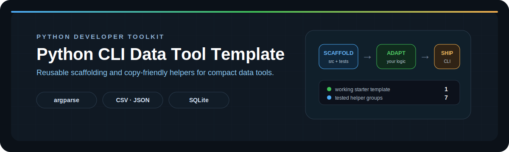

<p align="center">
  
</p>

# Python CLI Data Tool Template

Reusable project scaffolding and copy-friendly standard-library helpers for small Python data tools.


## Why this repository exists

Small automation projects repeatedly need the same foundation: argument parsing, logging, safe file output, CSV/JSON helpers, and a testable project layout. This repository keeps those pieces in one maintained place instead of copying outdated code from completed projects.

It serves two related purposes:

1. `project_template/` is a working starter project that can be copied and renamed.
2. `templates.py` is a single-file collection of focused helpers that can be copied individually.

## Included components

| Area | Included patterns |
|---|---|
| CLI | `argparse`, typed positive/non-negative integers, `Path` arguments |
| Logging | UTC timestamps, console output, optional UTF-8 log file |
| Files | Parent-directory creation, text and line helpers |
| CSV | Dictionary loading and writing with UTF-8 support |
| JSON | Safe loading and atomic writes through a temporary file |
| SQLite | Identifier normalization, table creation, inserts, counts, previews |
| Quality | pytest examples, package-style execution, GitHub Actions template |

## Repository structure

```text
.
├── .github/workflows/tests.yml
├── docs/python-cli-template-banner.svg
├── project_template/
│   ├── .github/workflows/tests.yml
│   ├── data/.gitkeep
│   ├── src/
│   │   ├── __init__.py
│   │   └── main.py
│   ├── tests/test_main.py
│   ├── .gitignore
│   ├── config_example.json
│   ├── pyproject.toml
│   ├── README.md
│   ├── requirements-dev.txt
│   └── requirements.txt
├── tests/test_templates.py
├── pyproject.toml
├── requirements-dev.txt
└── templates.py
```

## Using the project template

Copy `project_template/` into a new directory, rename the project, and replace the example transformation in `src/main.py` with project-specific logic.

```bash
cd project_template
python -m venv .venv
```

Activate the environment on Windows:

```powershell
.venv\Scripts\Activate.ps1
```

Install development dependencies and run the checks:

```bash
python -m pip install -r requirements.txt -r requirements-dev.txt
python -m pytest -q
python -m src.main --help
```

Example execution:

```bash
python -m src.main data/input.txt data/processed/output.txt
```

## Using individual helpers

`templates.py` deliberately stays as one file. Copy only the functions a project needs; remove unused imports afterward.

Example parser validation:

```python
parser.add_argument("--limit", type=positive_int, default=None)
```

Example atomic JSON output:

```python
save_json("data/processed/result.json", result)
```

Example UTC logging to both terminal and file:

```python
setup_logging("logs/run.log")
```

## Validation

From the repository root:

```bash
python -m pip install -r requirements-dev.txt
python -m pytest -q
(cd project_template && python -m pytest -q)
python -m compileall templates.py project_template/src
```

The first test command checks the reusable helpers. The second runs the starter
project as an independent repository, matching how it behaves after being copied.

## Design decisions

- Standard-library first: generated projects do not start with unnecessary runtime dependencies.
- Paths use `pathlib.Path` and output helpers create missing parent directories.
- JSON state is written atomically to reduce the chance of corrupting an existing file.
- CLI parsing is separated from execution so the core workflow remains testable.
- The starter project is intentionally small; it is a foundation, not a framework.

## Intended use

This repository is a personal developer toolkit for Python automation, scraping, CSV/JSON processing, SQLite utilities, and other compact CLI applications. Project-specific validation, retries, schemas, and domain logic should still be implemented inside each new project.
